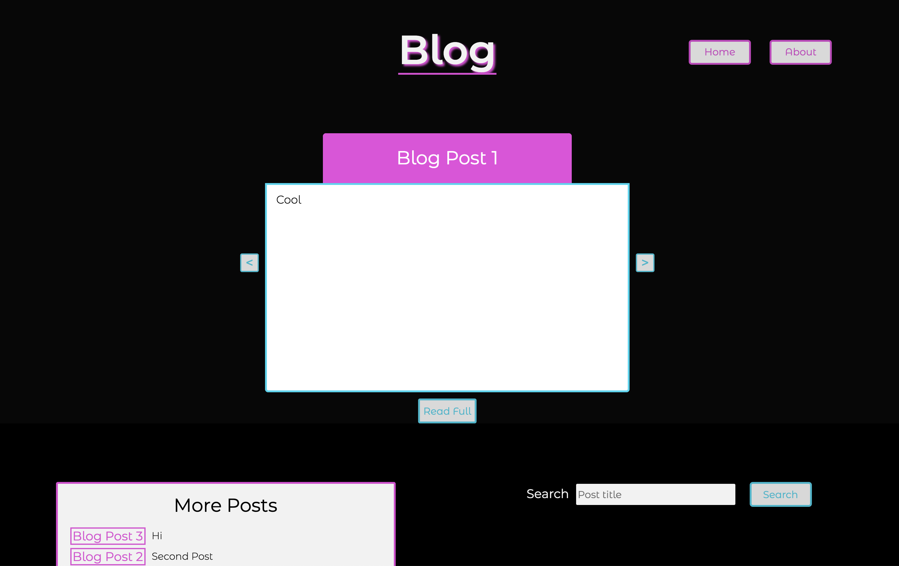

Deployed:

This is a blog website that I made while learning to use the Contentful CMS with React.

Users can click through a sliding carousel of recent blog posts, click a link to a specific blog post, or search for a blog post by title. Searches are programmed to return an exact match (if one exists) and similar matches if a post title is similar (but not exactly the same as) the entered search.

